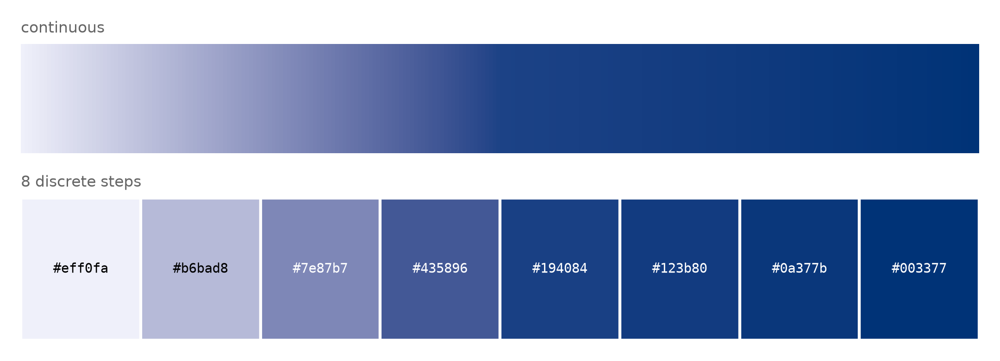
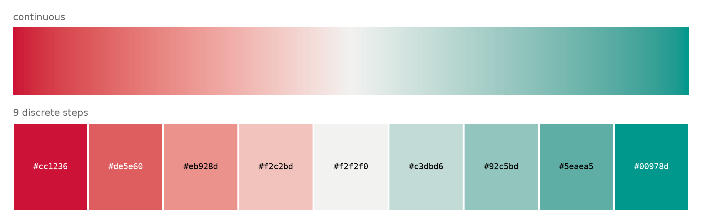
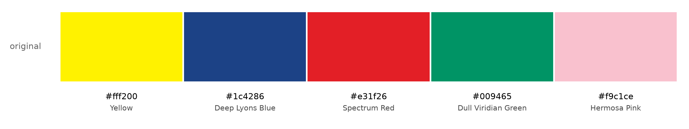
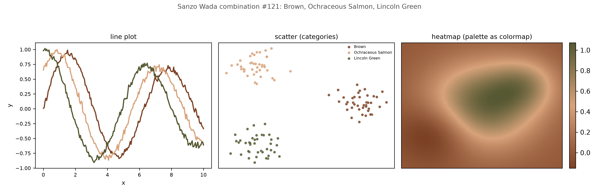

# Codes

Personal code repository for computational chemistry / data analysis scripts
(MD analysis, QM job setup, plotting, etc.).

## md/ — AMBER/cpptraj trajectory analysis

- **`com_density_single_anchor.py`** — single-colormap solute density
  heatmap (the plain style, before `com_density_timeseries.py` grew
  species-coloring), but centered on **one specific body** (e.g. one chosen
  PS molecule) rather than the solute assembly's collective centroid.
  `com_density_timeseries.py` deliberately avoids pinning any one body at
  the origin (diagnosed as a reference-choice artifact when it happened
  implicitly via cpptraj's `autoimage anchor`); this script does that ON
  PURPOSE -- no centroid correction afterward, so the chosen anchor body
  sits fixed at the origin (marked with a star) in every panel by
  construction. That answers a genuinely different question ("what does
  the local environment around this one specific molecule look like") from
  "where does the assembly condense relative to its own center" -- pick
  the right script for the question being asked. Defaults to short (e.g.
  0.1 ns) windows for near-instantaneous snapshots rather than long (e.g.
  40 ns) pooled ones -- note short windows are necessarily sparse (few
  frames x few bodies), showing up as a speckled rather than smooth
  density; that's the expected tradeoff for temporal sharpness, not a bug.
  Usage:
  ```
  python3 com_density_single_anchor.py PRMTOP TRAJ \
      --body-mask ":1-10" --body-mask ":11-20" ... \
      --anchor-mask ":101" --n-panels 6 --window-ns 0.1 --out out.png
  ```

- **`com_density_timeseries.py`** — visualizes solute aggregation over an MD
  trajectory as a 2D spatial density heatmap of solute bodies' centers of
  mass, binned into time windows, one or more systems as separate rows (e.g.
  several compositions stacked on the same time-window and color axes). Each
  body is tagged with a species (`--body-mask SPECIES MASK`); one species is
  the **field** (`--field-species NAME`, a standard single-colormap density
  heatmap with a normal log-scale colorbar) and the other(s) are **marked**
  (`--mark-species NAME --mark-color HEX`, each body's actual per-frame
  position plotted directly as scatter points on top). An earlier version
  tried encoding both species as a single blended hue (density-weighted
  color mix) — technically correct but hard to read at a glance, since a
  flat region of one blended tone doesn't obviously parse as "a mix of two
  things" the way a colormap + distinct marker does. Marking is also the
  natural choice whenever one species has very few bodies (a single catalyst
  cluster against ten photosensitizer copies, say): a "density" of one body
  is a weak concept, whereas marking its actual position is direct and
  unambiguous.

  Extracts each body's per-frame COM via cpptraj (`vector ... center`), then
  **re-centers every body on the solute assembly's own collective centroid
  each frame** before histogramming — important: naively plotting raw (or
  single-body-anchored) COM positions conflates "where is the assembly
  relative to one arbitrarily pinned reference body" with genuine spread/
  condensation, since cpptraj's `autoimage anchor <mask> origin` (needed to
  resolve periodic-boundary consistency across bodies) pins that anchor body
  at the origin in every frame by construction — recentering on the group's
  own centroid afterward removes that artifact. Requires cpptraj (AmberTools)
  on PATH. Usage (PS density as the field, CAT positions marked — this
  project's convention):
  ```
  python3 com_density_timeseries.py \
      --system "0% water" PRMTOP1 TRAJ1 \
      --system "100% water" PRMTOP2 TRAJ2 \
      --field-species PS --mark-species CAT --mark-color "#386641" \
      --body-mask CAT ":1-10" --body-mask CAT ":11-20" ... \
      --body-mask PS ":101" --body-mask PS ":102" ... \
      --anchor-mask ":1-10" --windows 5 --dt-ps 10 --out out.png
  ```
  `--mark-species`/`--mark-color` are optional — omit them for a plain
  single-species density heatmap with no marker overlay.

- **`solvent_density_timeseries.py`** — the solvent-side companion: same
  time-windowed, centroid-recentered 2D density heatmap, but for solvent
  molecules (e.g. water/methanol O) instead of solute bodies, to see
  whether solvent is depleted from the region where solutes condense
  (classic hydrophobic-collapse signature) or stays uniform. Extracting a
  per-molecule COM the way the solute script does doesn't scale to
  thousands of solvent molecules, so instead one cpptraj pass computes the
  solute centroid (same `vector ... center` calls, used only for
  recentering, not plotted) **and** strips the trajectory down to just the
  solvent's representative atom, writing it out as a small NetCDF read
  directly with `scipy.io.netcdf_file` — far cheaper than thousands of
  individual `vector` calls. Defaults to a **linear** color scale, not log:
  solvent density only varies by a modest factor between bulk and a
  depleted pocket near a solute cluster (not orders of magnitude the way
  the sparse solute case does), so log washes the contrast out under the
  huge uniform bulk value. Hit (and fixed) a real cpptraj mask-parser bug
  along the way: `strip !((:WAT@O)|(:MOH@O1))` throws `Mask::ToRPN:
  unbalanced parentheses in expression` even though the parens are balanced
  by any normal count — wrapping `!(...)` around an inner expression that
  itself has parens around each term breaks the parser; `strip
  !(:WAT@O|:MOH@O1)` (no inner parens) works. Requires cpptraj and scipy on
  PATH. Usage:
  ```
  python3 solvent_density_timeseries.py \
      --system "0% water" PRMTOP1 TRAJ1 \
      --solute-body-mask ":1-10" --solute-body-mask ":11-20" ... \
      --solvent-mask ":WAT@O" --solvent-mask ":MOH@O1" \
      --anchor-mask ":1-10" --windows 5 --box-half 27 --out out.png
  ```

- **`com_3d_snapshots.py`** — the 3D companion: matplotlib has no good
  volumetric/density rendering, so rather than a pooled 3D density this
  plots a handful of representative single frames (e.g. early/mid/late)
  side by side in 3D, colored by species — far more legible than a dense 3D
  point cloud would be. Same cpptraj COM extraction and centroid-
  recentering as `com_density_timeseries.py`. Usage:
  ```
  python3 com_3d_snapshots.py PRMTOP TRAJ \
      --body-mask CAT ":1-10" --body-mask CAT ":11-20" ... \
      --body-mask PS ":101" --body-mask PS ":102" ... \
      --species-color CAT "#386641" --species-color PS "#7798ab" \
      --anchor-mask ":1-10" --n-snapshots 4 --out out.png
  ```

## qm/ — ORCA job setup and TD-DFT UV-vis post-processing

Scripts built around an ORCA 6 workflow: ground-state geometry optimization
(B3LYP-D3(BJ)/def2-SVP, CPCM solvent, RIJCOSX) followed by a single-point
TD-DFT calculation (def2-TZVP) on the optimized geometry to get vertical
excitation energies and oscillator strengths, from which a UV-vis spectrum
is simulated.

- **`orca_submit.slurm`** — generic SLURM submission script for ORCA 6 jobs
  on the cluster. Usage: `sbatch orca_submit.slurm <input>.inp`. Loads the
  `orca6` module (adding `/usr/license/modulefiles` to `MODULEPATH` first,
  since it isn't there by default), stages the job (input + all `.xyz`
  files in the submit directory) on node-local scratch
  (`/public/<host>/scratch/tmp/...`), runs ORCA there, and copies every
  output file back to the submit directory on success. On failure it
  appends an entry to an `I_CRASHED` file (timestamp, host, scratch path)
  instead of silently losing the job.

All the Python scripts below follow the same convention: `python3
script.py FILENAME [options]`, where `FILENAME` is the ORCA log/output file
(or, for `make_combined_xyz.py`, an xyz file) to read — no editing the
script or hardcoding paths required. Every one also works on a log file
from a job that's still running, since they only read the shared-filesystem
`.log` (never the job's node-local scratch directory).

- **`plot_uvvis.py FILENAME [--out <prefix>] [--fwhm 0.4] [--xmin 200]
  [--xmax 700] [--exp-ref nm nm ...]`** — parses the `ABSORPTION SPECTRUM
  VIA TRANSITION ELECTRIC DIPOLE MOMENTS` table out of an ORCA TD-DFT
  output/log file (state, energy, wavelength, oscillator strength for each
  root) and converts the discrete stick transitions into a continuous,
  Gaussian-broadened UV-vis spectrum using the standard
  `eps(E) = 1.3062974e8 * sum_i [f_i/FWHM] * exp(-4 ln2 ((E-E_i)/FWHM)^2)`
  convention (same one used by Multiwfn/GaussView-style UV-vis tools).
  Writes the raw transitions and the broadened spectrum to CSV, plus a
  PNG/PDF plot (broadened curve + stick spectrum overlay). `--out` defaults
  to the input filename's basename; pass `--exp-ref 286 450` to mark
  experimental reference wavelengths if you have them (none marked by
  default).
  Example: `python3 plot_uvvis.py rubpy3_uvvis.log`

- **`plot_opt_energy.py FILENAME [--out <prefix>]`** — plots the SCF energy
  at every cycle of an ORCA geometry optimization (parsed from each `TOTAL
  SCF ENERGY` block in the log), relative to the first cycle, in kcal/mol
  vs. cycle number. Useful for spotting real conformational jumps vs. just
  slow convergence — e.g. a sudden multi-kcal/mol step partway through
  usually means a genuine structural rearrangement, not numerical noise.
  Writes a CSV (cycle, energy in Eh/eV, relative kcal/mol) plus a PNG/PDF.
  Example: `python3 plot_opt_energy.py rubpy_mos_opt.log`

- **`make_trj_xyz.py FILENAME [--out trajectory.xyz]`** — extracts every
  `CARTESIAN COORDINATES (ANGSTROEM)` block from an ORCA geometry-
  optimization log file and writes them out as a standard multi-frame xyz
  trajectory (one frame per optimization cycle), readable directly in VMD
  or any other xyz-trajectory viewer.
  Example: `python3 make_trj_xyz.py rubpy_mos_opt.log`

- **`make_combined_xyz.py FRAGMENT1.xyz FRAGMENT2.xyz [--gap 6.0] [--out
  combined.xyz]`** — combines two independently-optimized molecular
  fragments into a single multi-fragment `.xyz` file, placing the second
  fragment along +x at a safe, non-clashing center-to-center distance (sum
  of each fragment's own bounding-sphere radius, plus `--gap`). Used to
  build a starting geometry for a combined/supramolecular system (e.g. a
  photosensitizer + a catalyst) out of two separately-optimized pieces,
  ready for a joint geometry optimization.
  Example: `python3 make_combined_xyz.py rubpy3_opt.xyz mo3s13_opt.xyz --out rubpy_mos.xyz`

## plotting/ — figure-making helpers

- **`sanzo_wada_palette.py`** — browse and export color palettes from Sanzo
  Wada's 1933 *A Dictionary of Colour Combinations* for use in publication
  figures. Uses the open-sourced digitization of the book (159 named colors,
  348 curated 2-4 color combinations; MIT-licensed dataset from
  [mattdesl/dictionary-of-colour-combinations](https://github.com/mattdesl/dictionary-of-colour-combinations),
  cached locally as `sanzo_wada_colors.json` so the script works offline
  after the first run). Subcommands:
  - `list [--n-colors 2|3|4] [--search <name>]` — list/filter the 348 combinations
  - `show <id>` — print one combination's hex/RGB/name in the terminal
  - `export <id> --out <prefix> [--cvd-preview]` — render a clean swatch
    figure (PNG+PDF) plus ready-to-paste code: a Python hex list, a LaTeX
    `xcolor` `\definecolor` block, and a raw JSON dump. `--cvd-preview` adds
    protanopia/deuteranopia/tritanopia simulated rows underneath the
    original swatch as a quick (approximate) accessibility sanity check —
    these are historical aesthetic combinations, not validated
    colorblind-safe data-viz palettes, so treat this as a first-pass check,
    not a substitute for a proper categorical-palette validator.
  - `random [--n-colors N] [--out <prefix>]` — pick (and optionally export)
    a random combination, e.g. for picking an accent pairing quickly.
  - `gallery [--n-colors N] [--search <name>] [--limit 30] [--out <prefix>]`
    — render many combinations at once as a single browsable grid figure
    (one row per combination, labeled by id on the left), for visually
    scanning a filtered set instead of reading hex codes off `list`.

  Three commands follow the standard data-viz palette taxonomy (the same
  "job the color does" split used by the `dataviz` skill: sequential for
  magnitude, diverging for polarity, qualitative/categorical for identity):

  - `sequential (--color '#hex' | --from-combination <id>) [--steps 8]
    [--out <prefix>]` — one hue, light→dark: a magnitude colormap (e.g. for
    a heatmap), built by interpolating a single base hue between a near-
    white tint and a dark shade in CIELAB space (perceptually smoother than
    interpolating raw RGB).
  - `diverging (--colors '#hex1,#hex2' | --from-combination <id>)
    [--midpoint '#hex'] [--steps 9] [--out <prefix>]` — two hues + a
    neutral gray midpoint: a polarity colormap (e.g. positive/negative, or
    above/below a reference value). Never puts a hue at the midpoint.
  - `qualitative --n N [--out <prefix>] [--cvd-preview]` — pick N
    maximally-separated colors out of the full 159-color set via greedy
    farthest-point sampling in CIELAB space, for a categorical/identity
    palette rather than an aesthetically-coordinated combination.

  Both `sequential`/`diverging` render a continuous 256-step colorbar plus
  the requested discrete steps, and write a ready-to-use
  `LinearSegmentedColormap` to the Python snippet.

  - `cvd-test (--colors '#hex,...' | --from-combination <id>) [--out
    <prefix>]` — test **any** palette's real distinguishability under color
    vision deficiency: renders the protanopia/deuteranopia/tritanopia
    preview rows and prints the minimum pairwise CIE76 Delta-E, both for
    normal vision and under each simulated CVD type. This is a genuine
    numeric diagnostic, not just a picture to eyeball — it will explicitly
    warn when two colors are likely to collide (e.g. a red/green pair
    collapsing under deuteranopia), including for `qualitative` picks,
    which are CIELAB-separated under *normal* vision but aren't
    automatically guaranteed to stay separated under every CVD type.
  - `demo (--from-combination <id> | --colors '#hex,...') [--out <prefix>]`
    — render example line, scatter, and heatmap plots side by side, all
    using the same chosen palette (categorical colors for the lines/dots,
    the palette Lab-interpolated into a continuous colormap for the
    heatmap) — a quick way to see how a palette actually reads across
    different plot types before committing to it in a real figure.

  ### Example output

  All commands below are run from inside `plotting/`; the exact commands
  that produced every image here are also saved as a runnable script at
  [`examples/sanzo_wada/commands.sh`](plotting/examples/sanzo_wada/commands.sh)
  (`cd plotting && bash examples/sanzo_wada/commands.sh` reproduces all four).

  ```bash
  python3 sanzo_wada_palette.py sequential --color "#1c4286" --steps 8 \
      --out examples/sanzo_wada/sequential
  ```
  

  ```bash
  python3 sanzo_wada_palette.py diverging --colors "#cc1236,#00978d" --steps 9 \
      --out examples/sanzo_wada/diverging
  ```
  

  ```bash
  python3 sanzo_wada_palette.py qualitative --n 5 \
      --out examples/sanzo_wada/qualitative
  ```
  (note the honest deuteranopia/tritanopia warnings this particular pick
  gets — greedy CIELAB separation under normal vision doesn't guarantee CVD
  safety; see `cvd-test` above)

  

  ```bash
  python3 sanzo_wada_palette.py demo --from-combination 121 \
      --out examples/sanzo_wada/demo
  ```
  

  Each example folder also contains the matching `.pdf`, `_python.txt`
  (ready-to-paste hex list / colormap), `_latex.tex` (`xcolor`
  `\definecolor` block), and `.json` that the command itself writes.
